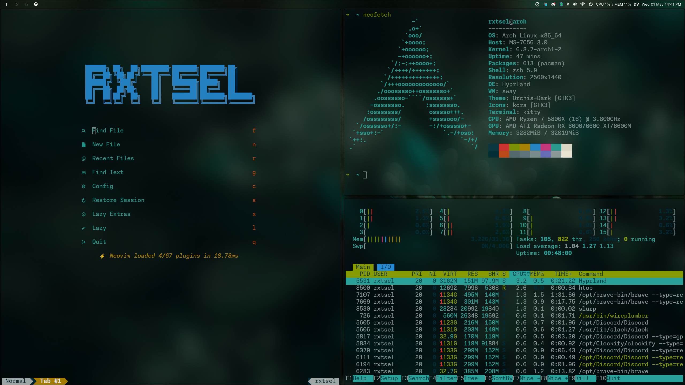
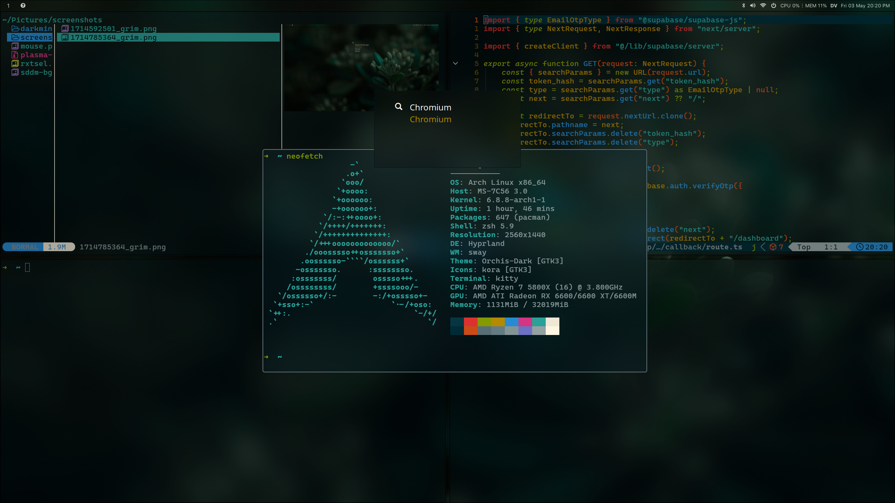
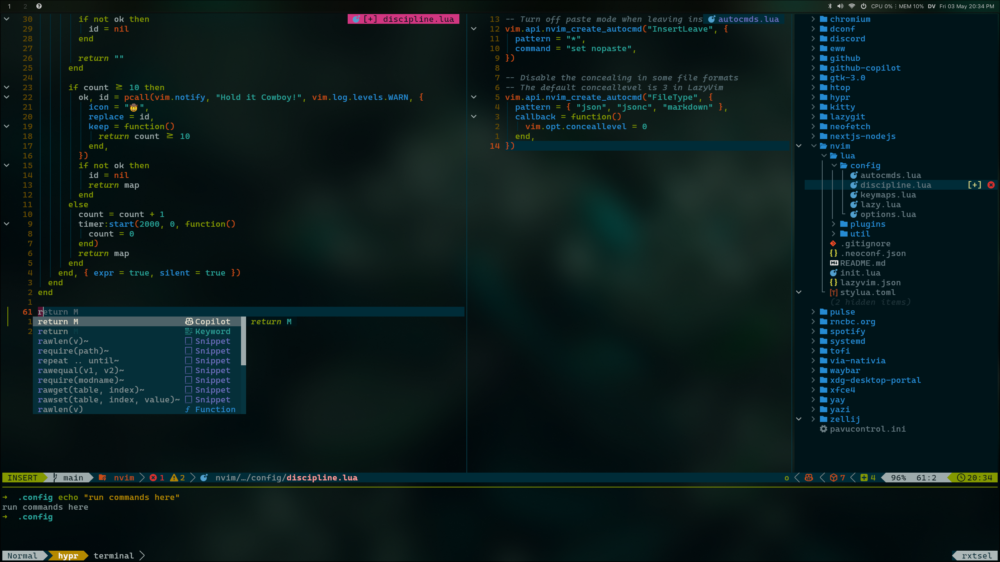

# After [minimal Arch linux setup](https://www.rxtsel.dev/en/blog/how-to-install-arch-linux-using-the-command-line/), then

My setup for Arch Linux with Hyprland, Waybar, Ghostty, and other tools. This setup is for a desktop environment, but it can be adapted to a laptop. This setup is based on **solarized-dark** colors.

## Indice

<!--toc:start-->

- [Gallery](#gallery)
- [Project Structure](#project-structure)
- [Installation](#installation)
  - [Option 1: Automatic Installation (Recommended)](#option-1-automatic-installation-recommended)
  - [Option 2: Manual Installation](#option-2-manual-installation)
- [1. Install AUR helper (paru or yay)](#1-install-aur-helper-paru-or-yay)
- [2. Install dependencies](#2-install-dependencies)
- [3. Oh-my-zsh](#3-oh-my-zsh)
- [4. Create symlinks for configurations](#4-create-symlinks-for-configurations)
- [5. Icons and Cursor Theme](#5-icons-and-cursor-theme-optional) (optional)
- [6. Utils for development](#6-utils-for-development-optional) (optional)
- [7. Darkman](#7-darkman) (optional)
- [8. rEFInd](#8-refind) (optional)
<!--toc:end-->

## Gallery



<details>
  <summary>Click here for more photos</summary>

|                                                           |                                                       |
| --------------------------------------------------------- | ----------------------------------------------------- |
|  |  |

</details>

## Project Structure

```sh
.
├── install.sh
├── README.md
├── .config/
│   ├── gammastep/
│   ├── ghostty/
│   ├── helix/
│   ├── hypr/
│   ├── lazygit/
│   ├── swaync/
│   ├── waybar/
│   ├── wlogout/
│   ├── wofi/
│   ├── yazi/
│   ├── zed/
│   └── zellij/
├── utils/
├── wallpapers/
├── .zlogin
└── .zshrc
```

## Installation

There are two ways to install this setup:

1. **Clone the repository**:

   ```bash
   sudo pacman -S git &&
   git clone https://github.com/rxtsel/.dot.git ~/.dot
   ```

### Option 1: Automatic Installation (Recommended)

2. **Make the install script executable and run it**:

   ```bash
   chmod +x ~/.dot/install.sh &&
   ~/.dot/install.sh
   ```

   The script will guide you through the installation process and ask for your preferences on optional components.

### Option 2: Manual Installation

Follow the steps below to install manually:

## 1. Install AUR helper (paru or yay)

You have 2 options to install an AUR helper:

- **Paru**:

  ```bash
  sudo pacman -S --needed base-devel
  git clone https://aur.archlinux.org/paru.git
  cd paru
  makepkg -si
  ```

- **Yay**:

  ```bash
  sudo pacman -S --needed git base-devel
  git clone https://aur.archlinux.org/yay.git
  cd yay
  makepkg -si
  ```

## 2. Install dependencies

1. **Pacman packages**:

   ```bash
   sudo pacman -Syyu --noconfirm git neovim qt5-wayland qt6-wayland slurp wofi grim hyprland \
     polkit-kde-agent swaync ghostty xdg-desktop-portal-hyprland chromium yazi fd \
     mpv nautilus ark bluez bluez-utils ripgrep wl-clipboard pavucontrol unzip libnotify fuse2 \
     7zip zsh imagemagick feh bat exa fzf thunderbird bluetui wget tree btop macchina lazygit waybar \
     gst-plugin-pipewire libpipewire pipewire pipewire-alsa pipewire-audio pipewire-jack pipewire-pulse discord aichat \
     darkman xdg-desktop-portal-gtk nwg-look gnome-keyring libsecret
   ```

2. **Fonts for emoji support**:

   ```bash
   sudo pacman -S noto-fonts noto-fonts-emoji unicode-emoji ttf-cascadia-code-nerd ttf-nerd-fonts-symbols ttf-font-awesome powerline-fonts --noconfirm
   ```

3. **AUR packages**:

   ```bash
   paru -S swww gammastep wlr-randr brave-bin ttf-twemoji-color wlogout otf-san-francisco

   # Or

   yay -S swww gammastep wlr-randr brave-bin ttf-twemoji-color wlogout otf-san-francisco
   ```

## 3. Oh-my-zsh

1. **Install Oh-my-zsh**:

   ```bash
   sh -c "$(curl -fsSL https://raw.githubusercontent.com/ohmyzsh/ohmyzsh/master/tools/install.sh)"
   ```

2. **Exit the terminal and open it again**. Oh-my-zsh will ask if she wants to have zsh by default, you say `yes`.
3. **Install plugins**:

   ```bash
   git clone https://github.com/zsh-users/zsh-autosuggestions ~/.oh-my-zsh/custom/plugins/zsh-autosuggestions &&
   git clone https://github.com/zsh-users/zsh-syntax-highlighting ~/.oh-my-zsh/custom/plugins/zsh-syntax-highlighting
   ```

## 4. Create symlinks for configurations

If a folder exists, it is deleted before create symlinks.

> **Note**: Only base configurations are included. You can add more configurations if you want. With `ln -s` command.

```bash
[ -f ~/.zshrc ] && rm -f ~/.zshrc
[ -d ~/.config/gammastep ] && rm -rf ~/.config/gammastep
[ -d ~/.config/ghostty ] && rm -rf ~/.config/ghostty
[ -d ~/.config/hypr ] && rm -rf ~/.config/hypr
[ -d ~/.config/lazygit ] && rm -rf ~/.config/lazygit
[ -d ~/.config/swaync ] && rm -rf ~/.config/swaync
[ -d ~/.config/waybar ] && rm -rf ~/.config/waybar
[ -d ~/.config/wlogout ] && rm -rf ~/.config/wlogout
[ -d ~/.config/wofi ] && rm -rf ~/.config/wofi
[ -d ~/.config/yazi ] && rm -rf ~/.config/yazi
[ -d ~/.config/zellij ] && rm -rf ~/.config/zellij

ln -s ~/.dot/.zshrc ~/.zshrc &&
ln -s ~/.dot/.config/{gammastep,ghostty,hypr,lazygit,swaync,waybar,wlogout,wofi,yazi,zellij} ~/.config
```

## 5. Icons and Cursor Theme (optional)

### Install Mkos-Big-Sur Icon Theme

Download and install the macOS-style [icon theme](https://github.com/zayronxio/Mkos-Big-Sur):

```bash
cd ~/Downloads/ &&
ICON_VERSION=$(curl -s https://api.github.com/repos/zayronxio/Mkos-Big-Sur/releases/latest | grep -Po '"tag_name": "\K.*?(?=")') &&
wget https://github.com/zayronxio/Mkos-Big-Sur/releases/download/$ICON_VERSION/Mkos-Big-Sur.tar.xz &&
7z x ~/Downloads/Mkos-Big-Sur.tar.xz &&
7z x ~/Downloads/Mkos-Big-Sur.tar &&
mkdir -p ~/.icons &&
rm -rf ~/Downloads/Mkos-Big-Sur.tar ~/Downloads/Mkos-Big-Sur.tar.xz &&
sudo mv ~/Downloads/Mkos-Big-Sur* ~/.icons/
```

### Install macOS Cursor Theme

Download and install the macOS [cursor theme](https://github.com/ful1e5/apple_cursor):

```bash
cd ~/Downloads/ &&
CURSOR_VERSION=$(curl -s https://api.github.com/repos/ful1e5/apple_cursor/releases/latest | grep -Po '"tag_name": "\K.*?(?=")') &&
wget https://github.com/ful1e5/apple_cursor/releases/download/$CURSOR_VERSION/macOS.tar.xz &&
7z x ~/Downloads/macOS.tar.xz &&
7z x ~/Downloads/macOS.tar &&
mkdir -p ~/.icons &&
rm -rf ~/Downloads/macOS.tar ~/Downloads/macOS.tar.xz &&
mv ~/Downloads/macOS* ~/.icons/
```

> [!NOTE]
> The cursor theme environment variables are already configured in the Hyprland configuration (`~/.config/hypr/conf/environment.conf`):
>
> ```conf
> env = HYPRCURSOR_THEME,macOS
> env = HYPRCURSOR_SIZE,24
> env = XCURSOR_THEME,macOS
> env = XCURSOR_SIZE,24
> ```

## 6. Utils for development (optional)

1. **Install [fnm](https://github.com/Schniz/fnm) node version manager**:

   ```bash
   curl -fsSL https://fnm.vercel.app/install | zsh &&
   export PATH="/home/rxtsel/.local/share/fnm:$PATH"
   eval "`fnm env`"
   ```

2. **Install a node version**:

   ```bash
   # list node versions remote
   fnm list-remote

   # install node version
   fnm install <your_version>
   ```

3. **Install fast package manager**:

   ```bash
   npm i -g @antfu/ni
   ```

4. **Install `cz-cli` globally**:

   ```bash
   npm install -g commitizen cz-conventional-changelog &&
   echo '{ "path": "cz-conventional-changelog" }' > ~/.czrc
   ```

## 7. [Darkman](https://darkman.whynothugo.nl/) (optional)

Darkman is a tool for automatically switching between light and dark modes on Linux. It works by calculating sunrise and sunset times based on your geographical location to automatically change system themes. Key features include:

- Automatic light/dark mode switching based on time of day
- Manual toggle support with `darkman toggle` command
- Integration with GTK themes and desktop portals
- Configurable based on geographical coordinates

For detailed installation instructions, configuration, and setup, please refer to the [Darkman documentation](utils/darkman/README.md).

## 8. [rEFInd](https://wiki.archlinux.org/title/REFInd) (optional)

rEFInd is more customizable than GRUB or systemd-boot; for example, you can change the theme, add icons, etc. It also allows the use of a mouse or touchpad, which is very useful when you have a wireless keyboard. Some features include:

- More customizable interface
- Ability to change themes and add icons
- Option to use mouse or touchpad
- Automatic detection of other operating systems, useful for multiboot setups

For detailed installation instructions, theme customization, and configuration, please refer to the [rEFInd documentation](utils/refind/README.md).
